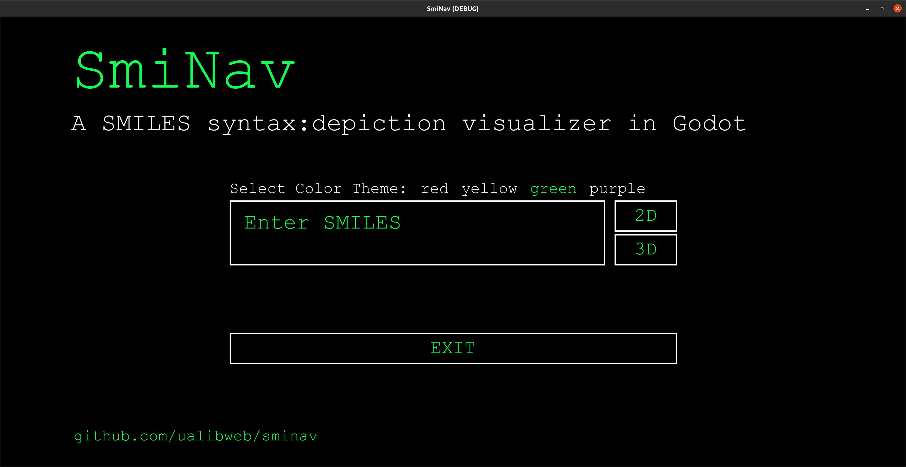
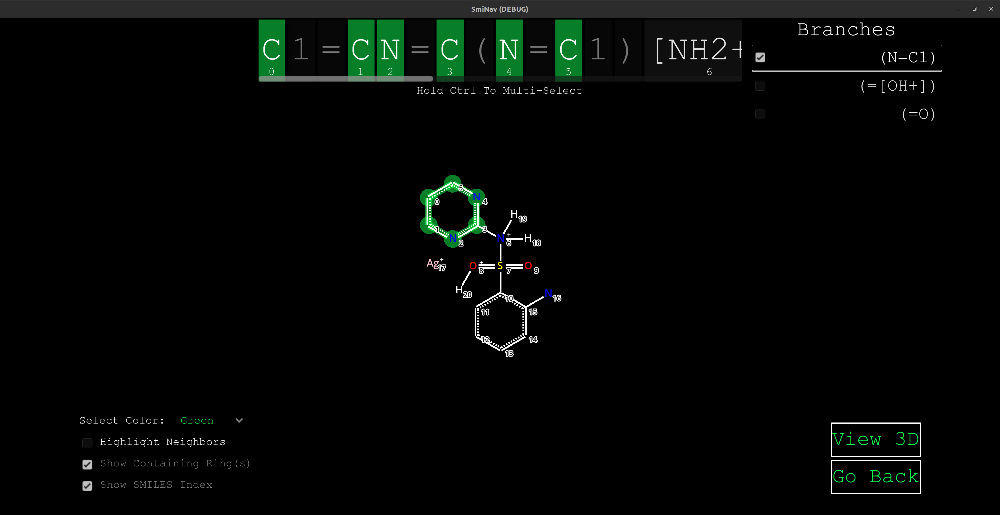

# SmiNav
### SMILES visualization with Godot

SmiNav (SMILES Navigator) is a GUI visualizer for parts of the SMILES syntax (atoms, neighbors, and rings). It was inspired by Andrew Dalke's [smiview](https://hg.sr.ht/~dalke/smiview). It uses the [RDKit](https://www.rdkit.org/) library in Python to parse the SMILES string and return mol coordinates and properties that are then used to create a 2D or 3D visualization of the molecule. The visualization is done using the [Godot game engine](https://godotengine.org/).

To use SmiNav, input a SMILES string, then click on an atom in the string. The corresponding atom in the depiction will then get highlighted. The reverse works as well; that is, click on an atom in the depiction and the corresponding atom in the SMILES string will get highlighted.

We did this for fun and to learn how to create interfaces in Godot. Any feedback and bug reports are very much welcome.

## Main Screen



## 2D



## 3D


## Installation of source code in godot

1. Download the source code from the repository
`git clone https://github.com/ualibweb/sminav.git`
2. Open Godot and click on `Import`
3. Navigate to the `SmiNav` folder and click on `Open` on the `project.godot` file

### To run the program

In the Godot editor, click on the `Play` button to run `►` the program on the top right corner of the window.

## Downlad binaries from Releases

For Linux x86, download the base `SmiNav_Linux.zip`

For Arm64 Linux systems like Raspi, download the `SmiNav_LinuxArm.zip`

For Windows systems, download the `SmiNav_Windows.zip`

### Running Binaries

1. Linux x86 - Open binary in file navigator or start from terminal (e.g., `./SmiNav.x86_64`)

2. Linux ARM64 - Open binary in file navigator or start from terminal with (e.g., `./SmiNav.arm64`)
     - If needed, use opengl3_es, `./SmiNav.arm64 --rendering-driver opengl3_es`

3. Windows - Click on SmiNav.exe

> **_NOTE:_** On all platforms, SmiNav will try to detect a .venv enviroment and if it has Python3 and RDKit installed. If not, you are given the option with "Install Requirements" to set this up for you. Alternatively, see below for manual instructions on how to setup your own virtual Python environment, if you do not want SmiNav
to do this for you. SmiNav creates the .venv folder in the SmiNav folder (you may need to show hidden files to see it).

---

For the program to run, you must have Python 3.7 or greater installed and Python virtual environments installed:

### Ubuntu/Debian Systems or Arm Linux Systems (like Raspberry Pi)

**Install Python 3.7 or greater and Virtual Environment**:
   - Most modern Ubuntu/Debian systems come with Python 3 already installed. You can check your Python version by running:
     ```bash
     python3 --version
     ```
   - If you don't have Python 3.7 or greater, install it:
     ```bash
     sudo apt-get install python3
     ```
   - Install `python3-venv` to use virtual environments:
     ```bash
     sudo apt-get install python3-venv
     ```

### Windows Systems

1. **Install Python 3.7 or greater**:
   - Download the Python installer from the [official Python website](https://www.python.org/downloads/). Make sure to download a version that is 3.7 or greater.
   - Run the installer. Ensure you check the box that says "Add Python 3.x to PATH" to make Python accessible from the command line.

2. **Install Virtual Environment**:
   - Open Command Prompt and install the virtual environment package:
     ```cmd
     pip install virtualenv
     ```

## Advanced Installation

### Manually Setting Up a Virtual Environment

If you prefer to manually set up a virtual environment within the SmiNav folder, follow these steps:

1. **Create a Virtual Environment**:
   - Open a terminal or command prompt and navigate to the project directory.
   - Run the following command to create a virtual environment (Windows users should replace `python3` with `python`):
     ```bash
     python3 -m venv .venv
     ```
   - This will create a new directory called `.venv` in your project folder. This directory contains a local Python environment that is isolated from your system-wide Python installation.
   - 
2. **Activate the Virtual Environment**:
   - Once the virtual environment is created, you need to activate it. Run the following command:
     - On Ubuntu/Debian:
       ```bash
       source .venv/bin/activate
       ```
     - On Windows:
       ```cmd
       .venv\Scripts\activate
       ```
   - When the virtual environment is activated, your terminal or command prompt will show the name of the environment at the beginning of the command line. This indicates that you are now working within the virtual environment.
     
3. **Install Dependencies**:
    - With the virtual environment activated, you can install the required Python packages using `pip`. Run the following command:
      ```bash
      pip install rdkit
      ```
    - This will install all the necessary Python packages for the project within the virtual environment, ensuring that they do not interfere with your system-wide Python installation.
  

### FAQ

1. If Python dependencies installation fails with SmiNav, delete the created .venv folder before trying again. Typical failure is not having Python 3 or Python venv installed.

2. Testing - We have last tested SmiNav with Godot v.4.2.1, RDKit 2023.09.05, and Python 3.11. See also the Godot minimum requirements: https://docs.godotengine.org/en/stable/about/system_requirements.html


### Known Limitations

1. In the 2D depictions, stereochemistry is not shown

2. Currently only the atom Symbols are interactive in the SMILES string.

3. When the "Highlight Neighbors" or "Show Containing Rings" boxes are checked, it does not yet highlight the additional atoms in the corresponding SMILES string (issue #1).

